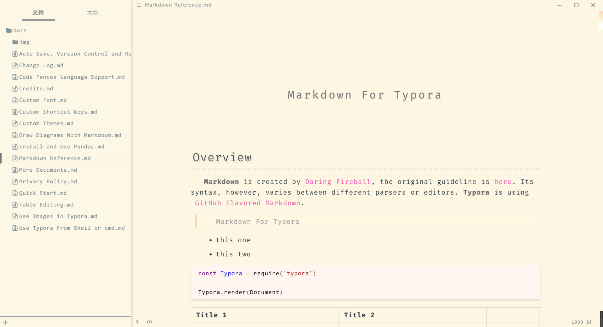
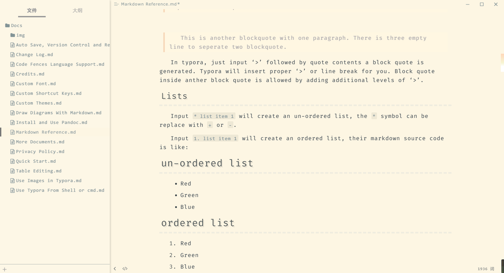
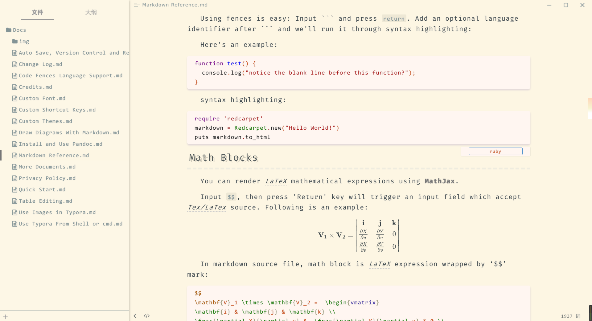

# typora-theme-tomotoes

> This is a typora theme based on Solarized theme and the style of [my personal website](https://tomotoes.com/)

## Introduction

**The Tomotoes theme** is based on the popular solarized style, and has added a large number of articles in my personal website design features, so that it is clean without losing focus, eye-protection and beautiful, is a comfortable theme.

Tested on Linux and Windows. Not fully tested, but should work on MacOS.

## Install

1. [Download](https://github.com/Tomotoes/typora-theme-tomotoes/tomotoes.css) this theme from Github, then you can get the `tomotoes.css` file .
2. Open typora. Click "**Open Theme Folder**" button from `Preference Panel` → `Apperance` section.
3. Put `tomotoes.css` into the opened folder, make sure your css files are directly under that directory.
4. Close and reopen Typora and select `Theme` → `Tomotoes` from the menu bar.

## Screenshots

